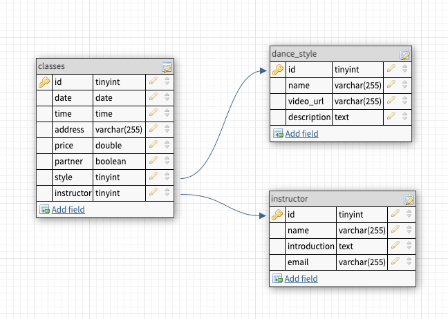

### mvp_dance-directory

This projects is a work in progress and forms part of the CodeOp Full Stack Development bootcamp curriculum. It constitutes the first of three projects and the goal is to produce an MVP of the student's choice.

The aim of this project is to create a centralised directory of dance classes for a certain location. Dance classes are organised by different teachers and schools and usually all communication happens via various Facebook groups. This can quickly get overwhelming for students as they need to spend a long time searching Facebook for suitable classes. Once they have identified them, they will need to join multiple groups and follow their communication threads in order to not to miss a change of location or a cancellation, for example. Furthermore - and this is especially true for the more classical dance styles like Ballroom dancing - a lot of participants tend to be older and don't usually use Facebook. So it is easy for them to miss out on updates or special events orgaised on social media.
This project hopes to address this problem by creating a directory off of Facebook that everyone with a computer or phone can accesss. Students can use filter options to quickly find what they're looking for and dance teachers only need to publish their classes in one place.

## To use this project:

- create a new empty database in mySQL
- modify database.js to point to your newly created database
- add an .env file with your database credentials
- add a .gitignore file and include your new env file in it
- inside the project folder run yarn or npm install to install dependencies
- in your .gitignore file, include the node_modules
- in the project client folder, run yarn or npm install to install dependencies
- in your project folder, run yarn migrate to create the required database tables
- use Postman or mySQl to add the sample data below into the corresponding tables
- start your servers

## API endpoints

For all tables the four main endpoints have been created (GET, POST, PUT, DELETE) and work as expected. Test in Postman to verify.
The most complex endpoint is the GET endpoint in the classes router. It can return all data in the table or just a selection depending on the user input on the front end. It contains two LEFT JOINs to incorporate data from the instructors and dance_styles tables. The code is a bit messy - if you have time, feel free to clean it up!

## Database structure

## Sample Data for dance_styles:

### Ready to insert data

INSERT INTO dance_styles(name, video_url, description, image) VALUES
("Bachata", "Bachata description", "https://www.youtube.com/embed/sBhWxgOLRwo", "Bachata_350x350.jpg"),
("Ballet", "Ballet description", "https://www.youtube.com/embed/3TLSrI_hXEw", "Ballet_350x350.jpg"),
("Ballroom", "Ballroom description", "https://www.youtube.com/embed/Ti_YU-vsG34", "Ballroom_350x350.jpg"),
("Salsa", "Salsa description", "https://www.youtube.com/embed/tBEc9Kni6I0", "Salsa_350x350.jpg"),
("Tango", "Tango description", "https://www.youtube.com/embed/7uA3mwfadAM", "Tango_350x350.jpg");

### Raw data

("name": "Bachata", "description" : "Bachata description", "video_url" : "https://www.youtube.com/embed/sBhWxgOLRwo", "image": "Bachata_350x350.jpg"),
("name": "Ballet", "description" : "Ballet description", "video_url" : "https://www.youtube.com/embed/3TLSrI_hXEw", "image": "Ballet_350x350.jpg"),
("name": "Ballroom", "description" : "Ballroom description", "video_url" : "https://www.youtube.com/embed/Ti_YU-vsG34", "image": "Ballroom_350x350.jpg"),
("name": "Salsa", "description" : "Salsa description", "video_url" : "https://www.youtube.com/embed/tBEc9Kni6I0", "image": "Salsa_350x350.jpg"),
("name": "Tango", "description" : "Tango description", "video_url" : "https://www.youtube.com/embed/7uA3mwfadAM", "image": "Tango_350x350.jpg");

## Sample Data for instructors:

### Ready to insert data

INSERT INTO instructors(name, introduction, email, photo) VALUES
("John", "John's Intro", "John@gmail.com", "/john_350x350.jpg"),
("Jenny", "Jenny's Intro", "Jenny@gmail.com", "/jenny_350x350.jpg"),
("Juan", "Juan's Intro", "Juan@gmail.com", "/juan_350x350.jpg");

### Raw data

{ "name": "John", "introduction": "John's Intro", "email": "John@gmail.com", "photo": "/john_350x350.jpg" }
{ "name": "Jenny", "introduction": "Jenny's Intro", "email": "Jenny@gmail.com", "photo": "/jenny_350x350.jpg" }
{ "name": "Juan", "introduction": "Juan's Intro", "email": "Juan@gmail.com", "photo": "/juan_350x350.jpg" }

## Sample Data for classes:

### Ready to insert data

INSERT INTO classes(name, day, time, address, price, partner, style, instructor, image) VALUES
("Beginner's Bachata", "1", "0", "Monday", "19:00", "Some Street, Some Town", "5", "1", "/Bachata_350x350.jpg"),
("Improvers's Bachata", "1", "1", "Tuesday", "19:00", "Some Street, Some Town", "5", "2", "/Bachata_350x350.jpg"),
("Advanced Ballet", "2", "Wednesday", "19:00:00", "Some Street, Some Town", "0", "5", "3", "/Ballet_350x350.jpg");

{ "name":"Kid's Ballet", "style":"2", "partner":"0", "day":"Thursday", "time":"19:00", "address":"Some Street, Some Town", "price":"5", "instructor":"1", "image":"/Ballet_350x350.jpg" }
{ "name": "Intermediate Ballroom Dancing", "style": "3", "day": "Friday", "time": "19:00:00", "address": "Some Street, Some Town", "partner": 1, "price": 5, "instructor": "2", "image":"/Ballroom_350x350.jpg" }
{ "name":"Beginner's Ballroom Dancing", "style":"3", "partner":"1", "day":"Saturday", "time":"19:00", "address":"Some Street, Some Town", "price":"5", "instructor":"3", "image":"/Ballroom_350x350.jpg" }
{ "name":"Intermediate Salsa", "style":"4", "partner":"0", "day":"Sunday", "time":"19:00", "address":"Some Street, Some Town", "price":"5", "instructor":"1", "image":"/Salsa_350x350.jpg"}
{ "name":"Beginner's Salsa", "style":"4", "partner":"1", "day":"Monday", "time":"19:00", "address":"Some Street, Some Town", "price":"5", "instructor":"2", "image":"/Salsa_350x350.jpg"}
{ "name":"Rueda", "style":"4", "partner":"0", "day":"Monday", "time":"19:00", "address":"Some Street, Some Town", "price":"5", "instructor":"2", "image":"/Salsa_350x350.jpg"}
{ "name":"Beginner's Tango", "style":"5", "partner":"1", "day":"Wednesday", "time":"19:00", "address":"Some Street, Some Town", "price":"5", "instructor":"1", "image":"/Tango_350x350.jpg"}
{ "name":"Advanced Tango", "style":"5", "partner":"0", "day":"Thursday", "time":"19:00", "address":"Some Street, Some Town", "price":"5", "instructor":"2", "image":"/Tango_350x350.jpg"}

### Raw data

{ "name":"Beginner's Bachata", "style":"1", "partner":"0", "day":"Monday", "time":"19:00", "address":"Some Street, Some Town", "price":"5", "instructor":"1", "image":"/Bachata_350x350.jpg" }
{ "name":"Improvers's Bachata", "style":"1", "partner":"1", "day":"Tuesday", "time":"19:00", "address":"Some Street, Some Town", "price":"5", "instructor":"2", "image":"/Bachata_350x350.jpg" }
{ "name": "Advanced Ballet", "style": "2", "day": "Wednesday", "time": "19:00:00", "address": "Some Street, Some Town", "partner": 0, "price": 5, "instructor": "3", "image":"/Ballet_350x350.jpg" }
{ "name":"Kid's Ballet", "style":"2", "partner":"0", "day":"Thursday", "time":"19:00", "address":"Some Street, Some Town", "price":"5", "instructor":"1", "image":"/Ballet_350x350.jpg" }
{ "name": "Intermediate Ballroom Dancing", "style": "3", "day": "Friday", "time": "19:00:00", "address": "Some Street, Some Town", "partner": 1, "price": 5, "instructor": "2", "image":"/Ballroom_350x350.jpg" }
{ "name":"Beginner's Ballroom Dancing", "style":"3", "partner":"1", "day":"Saturday", "time":"19:00", "address":"Some Street, Some Town", "price":"5", "instructor":"3", "image":"/Ballroom_350x350.jpg" }
{ "name":"Intermediate Salsa", "style":"4", "partner":"0", "day":"Sunday", "time":"19:00", "address":"Some Street, Some Town", "price":"5", "instructor":"1", "image":"/Salsa_350x350.jpg"}
{ "name":"Beginner's Salsa", "style":"4", "partner":"1", "day":"Monday", "time":"19:00", "address":"Some Street, Some Town", "price":"5", "instructor":"2", "image":"/Salsa_350x350.jpg"}
{ "name":"Rueda", "style":"4", "partner":"0", "day":"Monday", "time":"19:00", "address":"Some Street, Some Town", "price":"5", "instructor":"2", "image":"/Salsa_350x350.jpg"}
{ "name":"Beginner's Tango", "style":"5", "partner":"1", "day":"Wednesday", "time":"19:00", "address":"Some Street, Some Town", "price":"5", "instructor":"1", "image":"/Tango_350x350.jpg"}
{ "name":"Advanced Tango", "style":"5", "partner":"0", "day":"Thursday", "time":"19:00", "address":"Some Street, Some Town", "price":"5", "instructor":"2", "image":"/Tango_350x350.jpg"}
